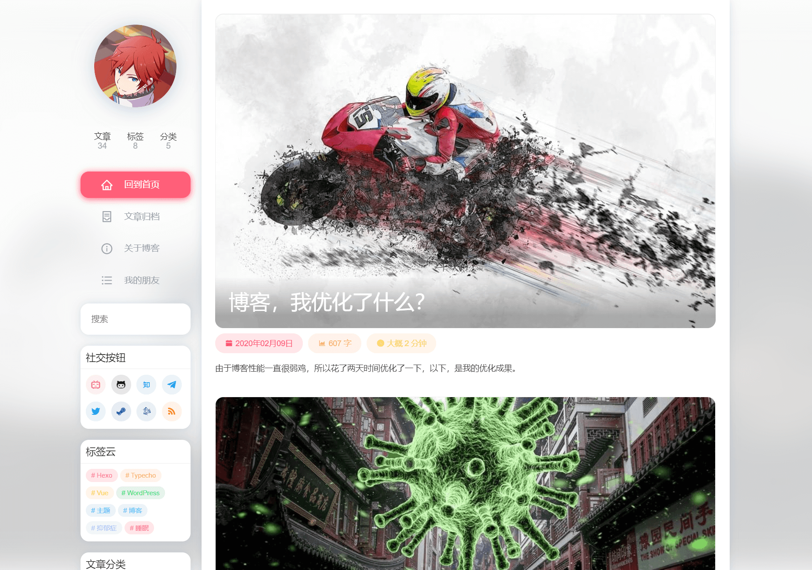

# WELCOME

### ✨Features

* Lazy loading of images
* Built-in multi-language
* Support for multiple comment plugins
* Page access statistics
* Sidebar filing information
* Lightbox large image
* Image waterfall
* Social buttons

### 🎓 Tutorials

Check out [https://docs.nexmoe.com/](https://docs.nexmoe.com/)

### 💻 Demo

Feel free to submit your site here

* [Nexmoe](https://nexmoe.com/)
* [Deep Sea Little Tao](https://hexo.xtaolink.cn/)
* [Watermelon Star 🍉✨](https://suikastar.com/)

### 💻 Contributors

### 🎇 Other versions

* Typecho: [https://github.com/nexmoe/typecho-theme-nexmoe](https://github.com/nexmoe/typecho-theme-nexmoe)
* Hexo-Saigyou\_Ayakashi: [https://github.com/SaigyoujiYuyuko233/Saigyou\_Ayakashi-HexoTheme](https://github.com/SaigyoujiYuyuko233/Saigyou_Ayakashi-HexoTheme)
* Solo-InkDP: [https://github.com/InkDP/solo-nexmoe](https://github.com/InkDP/solo-nexmoe)
* Hexo-Dark: [https://github.com/confuseder/hexo-theme-dark](https://github.com/confuseder/hexo-theme-dark)

### 🌏 Internationalization

Multi-language support, the default language is Simplified Chinese. At present, the Chinese translation is more complete, the translation of other languages is not complete, there is room for the big brother to contribute The language file is in languages, refer to `zh-CN.yml` for translation.

> You are more than welcome to help us translate Nexmoe to other languages!

### 📄 License

Open source under the Apache License 2.0.

### Buy me a milk tea

### 🍻 Subsequent updates

Attending high school. star and issue are my motivation to update! Welcome to add the group [482634342 Light Lament Comic Society](https://jq.qq.com/?%20_wv=1027&k=5CfKHun) 划水

Thematic discussion group: 614621637

Translated with www.DeepL.com/Translator \(free version\)

