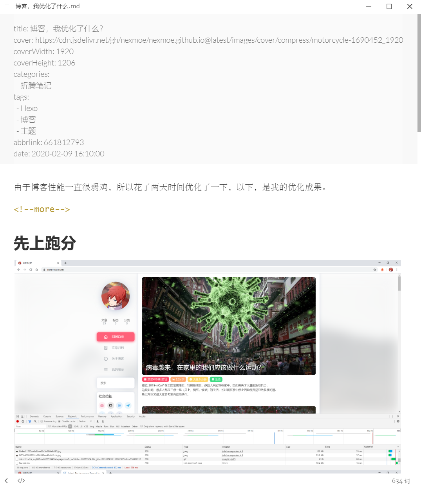

# 常见问题

## 未安装 wordcount

有时候运行错误会有 wordcount 这一关键词的报错，运行以下命令即可

```bash
npm i --save hexo-wordcount
```

## 代码高亮显示问题

主题内置代码高亮且自动开启，为了避免冲突，请在 `站点配置文件` 中禁用 highlight

```yaml
highlight:
  enable: false
```

## 首页取文章概述

Hexo 在写作的时候（_**许多博客都是这样的**_），需要在文中添加 **`<!--more-->`** 则该标记之前的部分就会成为该文章的概述，显示在首页里

_Hexo 在 **`<!--more-->`** 需要有一段内容_



