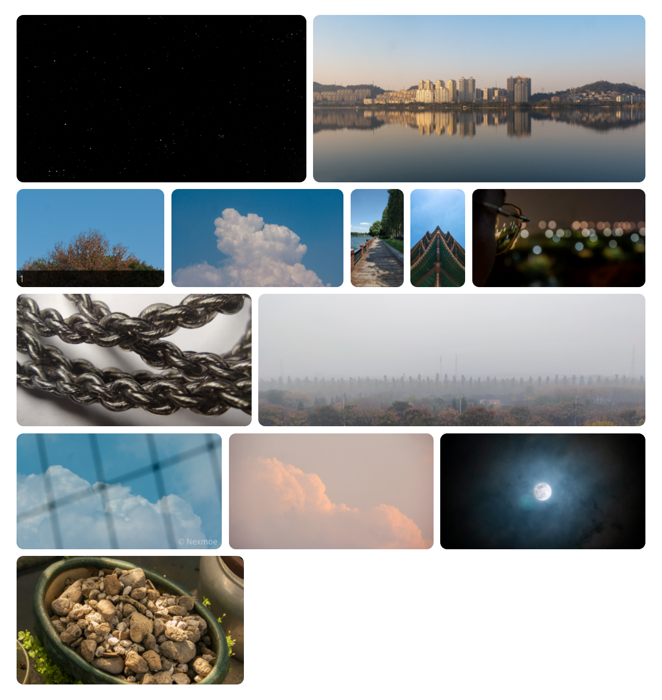

# Article Page

## Article pages

## Archive pages

Create a `.md` file in the `source` folder in the root of the site. The name and path of the file is a matter of personal preference and will determine the path of the rendered generated pages later.

Write the following to the file.

```yaml
---
title: article archive
layout: archives
---
```

> title can be changed to your preferred title permalink is the address of this page

Reference: [https://hexo.io/zh-cn/docs/front-matter](https://hexo.io/zh-cn/docs/front-matter)

## Links

### Create a page

Create a `.md` file in the `source` folder in the root of the site. The name and path of the file will be determined by personal preference and will determine the path of the rendered page.

Write the following to the file.

```yaml
---
title: links
date: 2013/7/13 20:46:25
layout: py
permalink: py.html
---
```

> title can be changed to your preferred title permalink is the address of this page

Reference: [https://hexo.io/zh-cn/docs/front-matter](https://hexo.io/zh-cn/docs/front-matter)

### Adding a friend link

Just add the following directly to `.md`

```text
- [! [title](https://example.com/logo.png)](https://example.com/ "title")
```

Example:

```text
- [! [Lightly Lamentable Navigation](https://www.chainwon.com/static/logo.png)](https://www.chainwon.com/ "Lightly Lamentable Navigation")
```

Demo: [https://nexmoe.com/PY.html](https://nexmoe.com/PY.html)

## Article cover image

Insert the cover value in the Front-matter, the value can be either a remote link to the image or an absolute path to the image, to prevent image jitter you need to fill in the original length and height of the cover image manually

```yaml
---
title: Hello World
date: 2013/7/13 20:46:25
cover: https://i.loli.net/2019/07/21/5d33d5dc1531213134.png
coverWidth: 1200
coverHeight: 750
---
```

## Waterfall Road images

```yaml




```

The effect is as follows



