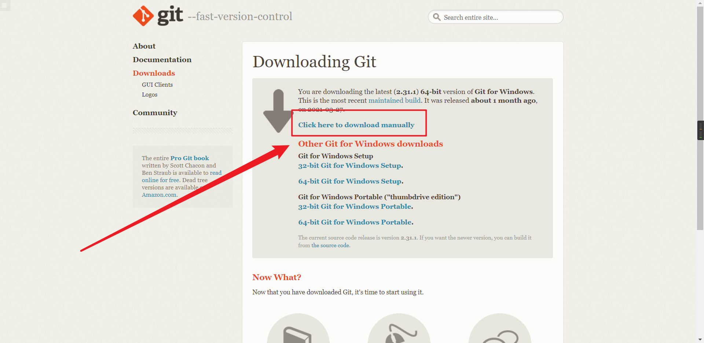

# 萌新教程

## 前言

本文意在什么也不知道也能快速上手，用的一些方法并不是最好的方式

## 安装 Node.js

进入 [https://nodejs.org/en/download/](https://nodejs.org/en/download/) 下载安装包，然后一直点 Next

## 安装 Git

进入 [https://git-scm.com/download/win](https://git-scm.com/download/win) 下载，然后一样的套路

## 安装 Hexo

按键盘上的 win + R 输入 cmd 回车，此后，**终端指的是 cmd 中**

1. 终端中输入  `npm config set registry https://registry.npm.taobao.org`
2. 终端中输入 `npm install -g hexo-cli` 安装 Hexo
3. 安装完毕后，终端输入 `cd C:\`  进入C盘根目录
4. 终端中输入 `hexo init blog` 在C盘根目录新建blog文件夹并初始化 Hexo
5. 终端中输入 `cd blog` 进入 Hexo 目录
6. 终端中输入 `npm install` 安装依赖

## 安装 Nexmoe 主题

1. 终端中输入 `npm i hexo-theme-nexmoe`
2. 终端中输入 `npm i --save hexo-wordcount`
3. 在 `C:\blog\config.yml` 中，修改 `theme` 的值为 `nexmoe`
4. 终端中输入 `hexo s --debug`
5. 在 Hexo 根目录下新建  `_config.nexmoe.yml` 

   然后对照 `C:\blog\node_modules\hexo-theme-nexmoe\_config.yml` 进行修改，

